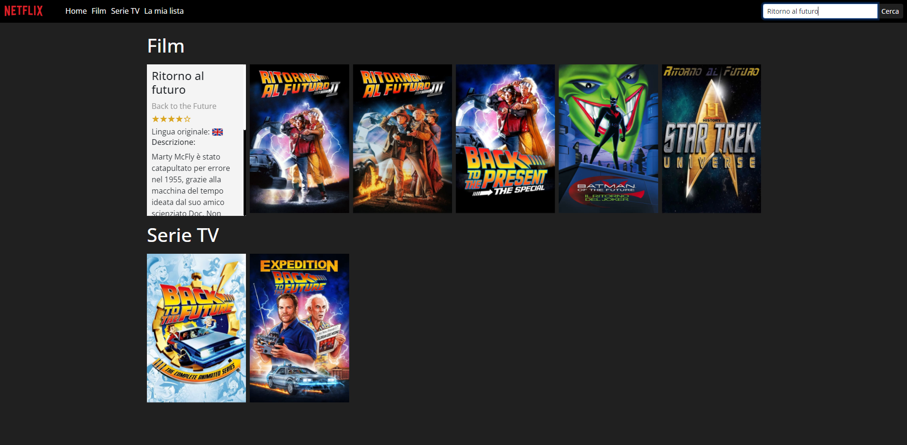

#  Boolflix 

Questa repository contiene il codice per un sito web di ricerca di film che consente agli utenti di cercare qualsiasi film o serie TV tramite una chiamata API. La homepage del sito mostra i film e le serie TV più popolari del momento.

## Funzionalità

- **Film e Serie TV Popolari**: La homepage mostra i film e le serie TV più popolari, offrendo agli utenti una panoramica di ciò che è in tendenza.
- **Funzionalità di Ricerca**: Gli utenti possono cercare facilmente un film o una serie TV specifica inserendo il titolo nella barra di ricerca. Il sito web visualizza quindi una lista di risultati pertinenti.
- **Card Interattive**: Ciascun risultato di ricerca è presentato sotto forma di card interattive. Quando si passa il mouse sopra, la card mostra informazioni aggiuntive come una breve descrizione e le valutazioni in stelle.

## Tecnologie Utilizzate

- Vue.js
- Vite
- HTML5
- CSS3
- JavaScript
- [The Movie Database](https://www.themoviedb.org/): API utilizzata per recuperare i dati dei film e delle serie TV.

## Screenshots

